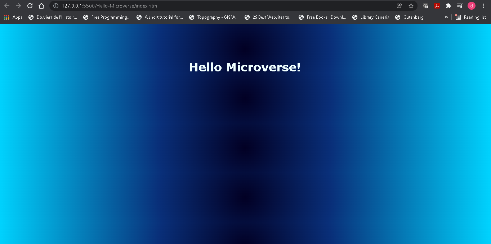

# Project Name

> This project is done as part of the 2nd day activities. It is made in order to help the student masters the tools and practice needed for all of followings projects in Microverse curriculum

Additional description about the project and its features.

## Built With

-HTML
-CSS
-Microverse html/css linter and markdown template

## Getting Started

**This is an example of how you may give instructions on setting up your project locally.**
**Modify this file to match your project, remove sections that don't apply. For example: delete the testing section if the currect project doesn't require testing.**

To get a local copy up and running follow these simple example steps.

### Prerequisites

Verify you install git (if not istall it)

### Setup

Set up git if needed

### Clone

Clone using the appropriate link from github

## Authors

👤 **Author1**

- GitHub: [@david-lafontant](https://github.com/david-lafontant)

## 🤝 Contributing

Contributions, issues, and feature requests are welcome!
t

## Show your support

Give a ⭐️ if you like this project!

## Acknowledgments

- Hat tip to anyone whose code was used such as the authors/contributors of the Microverse README.md template:
  @nidalaa nidalaa Emilia Andrzejewska
  @davidauza-engineer davidauza-engineer David Auza
  @kethinov kethinov Eric Newport
  @fernandorpm fernandorpm Fernando Marques

## 📝 License

This project is [MIT](./MIT.md) licensed.
